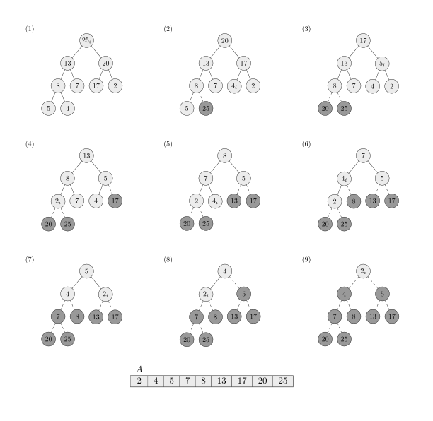
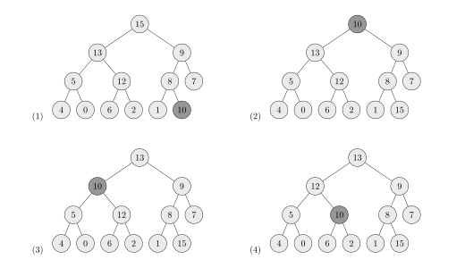
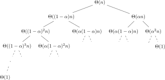

# CSC3100 Assignment 2

*Chen Ang (118010009)*


## Growth of Functions

### Problem 1

Writing $n=2^k,$ we apply induction on $k$ to show $T(n)=n\log n = k\cdot2^k$

**Base case**: For $k=1,$
$$
T(2^k)=T(2^1)=2=1\cdot 2^1
$$
**Induction hypothesis**: Assume for $k=m\ge 1,$
$$
T(2^k)=T(2^m)=m\cdot 2^m
$$
**Induction step**: For $k=m+1\gt 1,$ we have
$$
T(2^{k})=T(2^{m+1})=2T(2^m)+2^{m+1}
$$
due to the recurrence. But by the hypothesis this is nothing but
$$
2m\cdot 2^m+2^{m+1}=(m+1)2^{m+1}
$$
which completes the induction.

### Problem 2

No. 

For a reversed list $L$ of length $n,$ although it only takes, using binary search, $\Theta(\log (j-1))=\Theta(\log j)$ time to find the insertion index of $\text{key}=L[j],j\in\{2,3,\cdots, n\}$ (in this case the index would always be $1$ as $L[j]<L[i]$ for all $i\lt j$), we have to shift the sorted subarray $L[1:j-1]$ up one index before inserting $\text{key}$ at index $1.$ Thus the insertion of $\text{key}$ for each $j$ would consist of the following commands

```pseudocode
key = L[j] /* Θ(1) */
insert_idx = binary_search(key, L[1..j - 1]) /* Θ(log j) */
 /* i = j downto 2, therefore Θ(j) in total */
for i = j downto insert_idx + 1
	L[i] = L[i - 1] /* Θ(1) */
L[j] = key /* Θ(1) */
```

which takes $t(j)=Θ(\log(j))+Θ(j)+Θ(1)=Θ(j)$ time. That is, there exist $c_1,c_2,J\gt0$ such that
$$
c_1j\le t(j)\le c_2j,\quad\forall j\ge J\tag1
$$
Now for $n\ge \lceil J\rceil,$ the total time complexity is given by the sum
$$
T(n)=\sum_{j=2}^n t(j)=\sum_{j=2}^{\lfloor J\rfloor}t(j)+\sum_{j={\lceil J\rceil}}^nt(j)
= S + \sum_{j={\lceil J\rceil}}^nt(j)
$$
where we denote $S:=\sum_{j=2}^{\lfloor J\rfloor}t(j).$ Therefore by $(1)$ for all $n\ge \lceil J\rceil,$
$$
S+c_1\sum_{j={\lceil J\rceil}}^n j\le T(n)\le S+ c_2\sum_{j={\lceil J\rceil}}^n j\\
\underbrace{S+c_1 \frac{(n+\lceil J\rceil)(n-\lceil J\rceil+1)}{2}}_{f(n)}\le T(n)\le \underbrace{S+c_2 \frac{(n+\lceil J\rceil)(n-\lceil J\rceil+1)}{2}}_{g(n)}\\
$$
Clearly $f(n),g(n)=\Theta(n^2).$ So there exist $f_1,f_2,F,g_1,g_2,G\gt0$ such that
$$
f_1n^2\le f(n)\le f_2n^2,\quad \forall n\ge F\\
g_1n^2\le g(n)\le g_2n^2,\quad \forall n\ge G
$$
Define $M:=\max\{F,G,\lceil J\rceil\}.$ Then,
$$
f_1 n^2\le f(n) \le T(n) \le g(n) \le g_2n^2,\quad \forall n\ge M
$$
In other words $T(n)=\Theta(n^2)\neq\Theta(n\log n).$

### Problem 3

#### a.

Insertion-sorting each of the $n/k$ subarrays of length $k$ takes $\Theta(k^2)$ time, the sum of which is then
$$
\sum_{i=1}^{n/k}\Theta(k^2)=\frac nk \Theta(k^2)=\Theta(nk)
$$

#### b.

Merging two sorted array of length $m$ takes in the worst case $\Theta(m)$ time. At each level $i\in\{1,2,\cdots \log(n/k)\}$ of the merging tree we have $n/2^ik$ pairs of subarrays of length $2^{i-1} k$ to merge, taking $n/2^ik\cdot \Theta(2^{i-1}k)= \Theta(n)$ time. Hence the total running time in the worst case is 
$$
\log(n/k)\cdot\Theta(n)=\Theta(n\log(n/k)).
$$

#### c.

View $k:=k(n)$ as some fixed function of $n.$ We impose
$$
\begin{aligned}
\Theta(nk+n\log(n/k))&=\Theta(n\log n+nk-\log k)=\Theta(n\log n)\\
\end{aligned}
$$

Clearly $k$ cannot grow faster than $\log n$ because of the $nk$ term. Let us suppose $k=\Theta(\log n).$ Then,
$$
\begin{aligned}
\Theta(n\log n+nk-\log k)&=\Theta(n\log n+n\cdot\Theta(\log n)-\log(\Theta(\log n))\\
&=\Theta(n\log n+n\cdot\Theta(\log n))\\
&=\Theta(n\cdot\Theta(\log n))\\
\end{aligned}
$$
By definition for sufficiently large $n,$
$$
c_1n\log n\le n\cdot\Theta(\log n)\le c_2n\log n, \quad c_{1,2}\gt0
$$
Thus for any $f=\Theta(n\cdot\Theta(\log n)),$
$$
c_1c_1'n\log n\le c_1'n\cdot \Theta(\log n)\le f(n)\le c_2'n\cdot\Theta(\log n)\le c_2c_2'n\log n,\quad c_{1,2}'\gt0
$$
for sufficiently large $n,$ i.e.,
$$
f=\Theta(n\log n)
$$
showing
$$
\Theta(nk+n\log(n/k))=\Theta(n\log n)
$$
Hence $k=\Theta(\log n)$ is the largest choice asymptotically.


#### d.

Try the algorithm on samples with large $n$ and find the best choice of $k$.

### Problem 4

#### a.

$(1,5),(2,5),(3,4),(3,5),(4,5).$

#### b.

$[n,n-1,\cdots ,1].$ Each possible $(i,j)$ with $i<j$ is an inversion, in total $n-1+n-2+\cdots+2+1=n(n-1)/2$ of which.

#### c.

Suppose the array $A$ has length $n$ and number of inversions $m\in\{0,1,\cdots,n(n-1)/2\}.$ Then if we look at the algorithm

```pseudocode
INSERTION-SORT(A)
    for j = 2 to n
        key = A[j]
        i = j - 1
        while i > 0 and A[i] > key
            A[i + 1] = A[i]
            i = i - 1
        A[i + 1] = key
```

The while-loop

```pseudocode
while i > 0 and A[i] > key
    A[i + 1] = A[i]
    i = i - 1
```

should perform $\Theta(m)$ instructions within the entire execution. The reason is that for any $j\in\{2,\cdots ,n\},$ $(i,j)$ is an inversion in the original array
$$
A^{(1)}=[A[1..j-1], A[j], A[j..n]]
$$
if and only if $(i',j)$ is an inversion in the $j-$partially sorted array
$$
A^{(j)}=[\text{sorted}(A[1..j-1]),A[j], A[j..n]]
$$
where $i'$ is the index of element $A^{(1)}[i]$ in $A^{(j)}.$ Therefore it takes 
$$
\begin{aligned}
m^{(j)}&:=\#(i',j):i'<j,\text{sorted}(A[1..j-1])[i']>A[j]\\
&=\#(i',j):(i',j)\text{ is an inversion in }A^{(j)}\\
&=\# (i,j):(i,j)\text{ is an inversion in }A

\end{aligned}
$$
shifting operations of the last $m^{(j)}$ elements of $\text{sorted}(A[1..j-1])$ up one to make room for the element $A[j]$ (in the while loop), taking $\Theta\left(m^{(j)}\right)$ time. Since operations outside the while-loop are all constant-time, the time complexity of the $j$-th for-loop is dominated by the $\Theta\left(m^{(j)}\right)$ while-loop. Summing over all $j,$ we arrive at the total complexity
$$
T(m)=\sum_{j=2}^n\Theta(m^{(j)})=\Theta\left(\sum_{j=2}^nm^{(j)}\right)=\Theta(m).
$$

#### d.

```pseudocode
/* Merge sort A[p..r], return number of inversions (i, j) in A 
   with p <= i, j <= r */
MSORT-COUNT-INV(A, p, r)
	if p < r
		q = floor((p + r) / 2)
		left_inv = MSORT-COUNT-INV(A, p, q)
		right_inv = MSORT-COUNT-INV(A, q + 1, r)
		cross_inv = MERGE-COUNT-CROSS-INV(A, p, q, r)
		inv = left_inv + right_inv + cross_inv
		return inv
	return 0

/* Merge A[p..q] and A[q+1..r], return number of inversions (i, j) in A 
   with p <= i <= q && q + 1 <= j <= r. We assume p <= q < r. */
MERGE-COUNT-CROSS-INV(A, p, q, r)
	L = A[p..q]
	R = A[q+1..r]
	i = j = 1
	inv = 0
	while true
		idx = p + i + j - 2
		if L[i] > R[j]
			inv += r - j - idx + 1 /* Θ(1) added */
			A[idx] = R[j]
			j += 1
		else
			A[idx] = L[i]
			i += 1
		if i > q - p + 1
			A[q+j..r] = R[j..r-q]
			break
		else if j > r - q
			A[p+i-1..q] = L[i..q-p+1]
			break
	return inv
```

The above pseudocode merge-sorts an array `A` and returns the number of inversions. The structure of the algorithm is almost identical to the vanilla merge sort. The only difference is that in the merge subroutine we add some constant-time operations. Therefore this modified merge sort has the same recurrence relation as merge sort:
$$
T(n)=2\cdot T(n/2)+\Theta(n)
$$
which yields the familiar complexity
$$
T(n)=\Theta(n\log n)
$$

### Problem 5

Denote $h(n):=\max\{f(n),g(n)\}.$ Then
$$
\begin{aligned}
{h(n)\ge f(n)\\
h(n)\ge g(n)}\end{aligned}\implies
h(n)\ge \frac{f(n)+g(n)}2
$$
On the other hand, since $f$ and $g$ are asymptotically nonnegative, for sufficiently large $n,$
$$
h(n)=\begin{cases}
f(n),\quad \text{if }f(n)>g(n) \\
g(n),\quad \text{otherwise}
\end{cases}\le f(n) + g(n)
$$
Therefore
$$
h(n)=\max\{f(n),g(n)\}=\Theta\left( f(n) + g(n)\right)
$$

### Problem 6

#### a.

$$
\begin{CD}
\text{order}@>>> \\@VVV
\begin{aligned}
&\boxed{1\overset{\Theta}=n^{1/\log n}}

\\&||_{o}\\

&\boxed{\log(\log^*n)}
\overset{o}=\boxed{\log^*(\log n)\overset\Theta =\log^*n}
\overset{o}=\boxed{2^{\log^*n}}
\overset{o}=\boxed{\ln\ln n}
\overset{o}=\boxed{\sqrt{\log n}}

\\&||_{o}\\

&\boxed{\ln n}
\overset{o}=\boxed{\log^2 n}
\overset{o}=\boxed{2^{\sqrt{2\log n}}}
\overset{o}=\boxed{\sqrt2^{\log n}}

\\&||_{o}\\

&\boxed{n\overset\Theta= 2^{\log n}}
\overset{o}=\boxed{n\log n}
\overset{o}=\boxed{\log(n!)}
\overset{o}=\boxed{n^2\overset\Theta=4^{\log n}}
\overset{o}=\boxed{n^3}
\overset{o}=\boxed{(\log n)!}
\overset{o}=\boxed{(\log n)^{\log n}\overset\Theta = n^{\log\log n}}

\\&||_{o}\\

&\boxed{(3/2)^n}
\overset{o}=\boxed{2^n}
\overset{o}=\boxed{n\cdot 2^n}
\overset{o}=\boxed{e^n}

\\&||_{o}\\

&\boxed{n!}
\overset{o}=\boxed{(n+1)!}

\\&||_o\\

&\boxed{2^{2^n}}
\overset{o}=\boxed{2^{2^{n+1}}}

\end{aligned}


\end{CD}\tag2
$$

Note: Each box contains all functions of the same order, i.e., $f,g$ are in the same box if and only if $f=\Theta(g).$ The little $o$ notations are read from left to right, top to bottom. That is, functions on the upper levels are of lower orders than functions on levels below. On a same horizontal level, functions in the left boxes are of lower orders than functions in the right ones.

#### b.

Denote $\text{big}(n):= 2^{2^{n+1}},$ the fastest growing function in $(2).$ Then $\text{DADDY}(n):=\text{big}^2(n)$ grows even faster, that is, for any function $g$ in $(2),$
$$
g=o(\text{DADDY})
$$
Now define
$$
f(n):=\begin{cases}
\begin{aligned}
&\text{DADDY}(n),&\text{if }n\text{ is prime}\\
&0,&\text{otherwise}

\end{aligned}
\end{cases}
$$
Then no function $g$ in $(2)$ can upper-bound $f$ asymptotically by any constant factor $c\gt0$, since
$$
\begin{aligned}
g=o(\text{DADDY})\implies \limsup_{n\to \infty}\frac{f}{cg}(n)&=
\limsup_{n\to\infty}\begin{cases}
\begin{aligned}

&\frac{\text{DADDY}}{cg}(n),&\text{if }n\text{ is prime}\\
&0,&\text{otherwise}

\end{aligned}

\end{cases}\\
&=\limsup_{m\to\infty}\frac{\text{DADDY}}{cg}(p_m)
\end{aligned}
$$
where $p_m$ is the $m$-th prime. As $m\to\infty,p_m\to\infty$ due to the infinitude of primes. Thus $({\text{DADDY}}/{cg})_{m=1}^\infty$ is a subsequence of $(f/cg)_{n=1}^\infty,$ and
$$
\lim_{m\to\infty}\frac{\text{DADDY}}{cg}(p_m)=\lim_{n\to\infty}\frac{f}{cg}(n)=\infty
$$
Hence
$$
\limsup_{n\to \infty}\frac{f}{cg}(n)=\limsup_{m\to\infty}\frac{\text{DADDY}}{cg}(p_m)=\infty
$$
which implies
$$
f\neq O(g)
$$
On the other hand, no $g$ in $(2)$ can lower-bound $f$ asymptotically by any constant factor $c\gt0$ either, since
$$
\liminf_{n\to \infty}\frac{f}{cg}(n)=0
$$
and so
$$
f\neq\Omega(g)
$$

## Divide-and-Conquer

### Problem 7

We wish to construct positive constants $c,N$ such that for all $n\ge N,$
$$
T(n)\le c n\log n
$$
through strong induction on $n.$

**Base cases**: For $2\le n\le N,T(n)\le cn\log n.$

**Induction hypothesis**: Assume for $N\le n\lt k,$ we have $T(n)\le cn\log n.$

**Induction step**: For $n=k,$ we utilize the recurrence relation to see
$$
\begin{alignedat}{2}
T(k)-ck\log k&=2T(\lfloor k/2\rfloor+17)+k-ck\log k\\

&\le2c(\lfloor k/2\rfloor+17)\log(\lfloor k/2\rfloor+17)+k-ck\log k &(2\le\lfloor k/2\rfloor+17\lt k)\\

&\le c(k+34)\log(k/2+17)+k-ck\log k\\

&=ck\log(1/2+17/k)+34c\log(k/2+17)+k\\

&\le -ck/2+34c\log(k/2+17)+k &(k\ge 83)\\

&\le -ck/2+34c\log(k)+k &(k\ge 34)\\

&\le (1-c/2)k+34c\sqrt k &(k\ge16)\\

&\le 0 &(c\gt2,\sqrt k\ge 68/(1-2/c)\gt 68)
\end{alignedat}
$$
For the induction step and base cases to hold we need the intersection of all conditions previously imposed on constant $k,c$ to be true:
$$
k\gt 68^2,c\gt2,T(n)\le cn\log n,\quad 2\le n\le N
$$
which can be easily achieved by picking
$$
N:=68^2,c:=\max\left\{
\frac{T(n)}{n\log n}:2\le n\le N
\right\}+3
$$
One may verify that the above induction works under this set of constants. Hence,
$$
T(n)=O(n\log n)
$$

## Elementary Data Structures

### Problem 8

Using existing Python `Queue` class,

```python
from queue import Queue
class QStack:
    def __init__(self):
        self.inQ = Queue()
        self.outQ = Queue()
        self.top = None

    # len: θ(1)
    def __len__(self):
        return self.inQ.qsize()

    # is_empty: θ(1)
    def is_empty(self):
        return len(self) == 0

    # push: θ(1)
    def push(self, item):
        self.inQ.put(item)
        self.top = item

    # pop: θ(n)
    def pop(self):
        assert not self.is_empty()
        if len(self) == 1: return self.inQ.get()
        while True:
            item = self.inQ.get()
            if len(self) == 1:
                self.top = item
                self.outQ.put(item)
                item = self.inQ.get()
                self.inQ, self.outQ = self.outQ, self.inQ
                return item
            self.outQ.put(item)

    # peek: θ(1)
    def peek(self):
        assert not self.is_empty()
        return self.top
```

- Both `__len__` and `is_empty` invoke `qsize` method from the `Queue` class to retrieve the queue length, which is $\Theta(1).$

- `push` invokes `put` method from the `Queue` class once, which takes $\Theta(1)$ time; it then assign `item` to the `top` field, taking $\Theta(1)$ as well. So the total complexity of `push` is $\Theta(1).$
- `pop` successively `get` all $n$ items from `inQ` and, for each item, performs constant-time operations on it. Since `get` method is $\Theta(1),$ the `pop` operation takes $n\cdot\Theta(1)=\Theta(n)$ time. Note in the end of the while-loop, the swapping of `inQ` and `outQ` is essentially a swapping of two pointers and only takes constant time, which does not affect the overall running time asymptotically.
- `peek` takes $\Theta(1)$ by simply retrieving the `top` data field of the object.

### Problem 9

Using existing Python `sllist` class from `llist` module,

```python
from llist import sllist
class LLStack:
    def __init__(self):
        self.ll = sllist()

    # len: θ(1)
    def __len__(self):
        return self.ll.size
    
    # push: θ(1)
    def push(self, value):
        # Equivalent to L.LIST-INSERT(L.head) in the book
        return self.ll.appendleft(value)

    # pop: θ(1)
    def pop(self):
        assert len(self) > 0
        # Equivalent to L.LIST-DELETE(L.head) in the book
        return self.ll.popleft()

    # peek: θ(1)
    def peek(self):
        assert len(self) > 0
        return self.ll.first.value
```

## Heap

### Problem 10

Suppose that the $n$-element heap is represented by array $A,$ then for $1\le i\le n,$
$$
A[i]\text{ is a leave}\iff A[i] \text{ has no child}\iff 2i\gt n\iff i\ge\frac n2
$$
which is equivalent to
$$
i\in\left\{\left\lfloor\frac n2 \right\rfloor+1,\cdots ,n\right\}
$$

### Problem 11



### Problem 12



## Sorting

### Problem 13

The recurrence is given by
$$
T(n)=T((1-\alpha)n)+T(\alpha n)+\Theta(n)
$$
with $0\lt \alpha \le 1/2\le 1-\alpha.$

Drawing out the recurrence tree,



(Here all $\Theta(\cdot)$ should be interpreted as ONE single function $f(n)$ of order $\Theta(n)$ applied to different arguments)

We see that the maximum depth occurs on the leftmost branch
$$
\Theta(n)\to\Theta((1-\alpha)n)\to\cdots\to\Theta((1-\alpha)^i n)\to\cdots\to \Theta((1-\alpha)^Dn)=\Theta(1)
$$

which has depth, approximately,
$$
D(n)\approx\log_{1-\alpha}{\frac 1n}=-\log_{1-\alpha}n=-\frac{\log n}{\log(1-\alpha)}
$$
The minimum depth occurs on the rightmost branch
$$
\Theta(n)\to\Theta(\alpha n)\to\cdots\to\Theta(\alpha^i n)\to\cdots\to \Theta(\alpha^d n)=\Theta(1)
$$
which has an approximate depth of
$$
d(n)\approx \log_\alpha\frac 1n=-\log_\alpha n=-\frac{\log n}{\log \alpha}
$$

### Problem 14

Suppose that the array $A$ to be count-sorted contain two elements $A[p],A[q]$ having the say key $k^*,$ and that $p<q.$ Since we insert the elements of $A$ at different positions (guided by array $C$) in array $B$ in a reversed order, we must insert $A[q]$ before $A[p].$ Suppose at some point in the insertion process, we insert $A[q]$ at $B[c],$ where $c$ denotes the value of $C[k^*]$ *at that moment.* The algorithm then decrements $C[k^*]$ by one, i.e.,
$$
C[k^*]\leftarrow c-1
$$
Note that values in $C$ can only be decremented in the entire insertion process. Therefore, when inserting $A[p]$ at some $B[c']$ later, we must have that
$$
c'=C[k^*]\le c-1\lt c
$$
and we are done.

