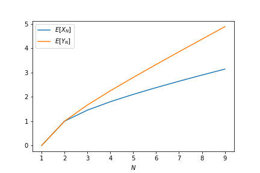

# CSC3170 Assignment 3

**CHEN Ang (118010009)**

## 1

### (a)

To locate a record at position $k$, one needs to compare it with records at positions $1,2,...,k$, in a total of $k$ comparisons. (***Except when the record to locate is at position $N$, only $N-1$ comparisons are needed, as we already know the record is present in the file***.) Hence, with support $k\in[1..N-1]$,
$$
\Pr(X_N=k)=\begin{aligned}\begin{cases}
p_k&:k\in[1..N-2]\\
p_{N-1}+p_{N}&:k=N-1

\end{cases}\end{aligned}
$$
Thus,
$$
\begin{aligned}
\mathbb E[X_N]&=\sum_{k=1}^{N-1}k\cdot\Pr(X_N=k)\\
&=(N-1)(p_{N-1}+p_N)+\sum_{k=1}^{N-2}k\cdot p_k\\
&=C(N-N^{-1})

\end{aligned}
$$
Since $\sum_{k=1}^N p_k=C\sum_{k=1}^N1/k=1$, the normalizing constant $C=1/H_N$, where $H_N=\sum_{k=1}^N1/k$ is the $N$-th harmonic number. Therefore,
$$
\mathbb E[X_N]=\frac{N-N^{-1}}{H_N}
$$

### (b)

Let $Y_N$ be the number of comparisons to locate a record present in $N$ records following the uniform distribution. Similar to **(a)**, with support $k\in[1..N-1]$,
$$
\Pr(Y_N=k)=\begin{aligned}\begin{cases}
1/N &:k\in[1..N-2]\\
2/N&:k=N-1

\end{cases}\end{aligned}
$$
Thus
$$
\begin{aligned}
\mathbb E[Y_N]&=\sum_{k=1}^{N-1}k\cdot\Pr(Y_N=k)\\
&=(N-1)(2/N)+\sum_{k=1}^{N-2}k/N\\
&=\frac{(N-1)(N/2+1)}N

\end{aligned}
$$
Plugging in $N=10$ for $X_N$ and $Y_N$, we see that
$$
\begin{aligned}
\mathbb E[X_{10}]&=\frac{10-10^{-1}}{H_{10}}=\frac{2268}{617}=3.38...\\
<\mathbb E[Y_{10}]&=\frac{(10-1)(10/2+1)}{10}=\frac{27}{5}=5.4

\end{aligned}
$$
The search performance is **worse** under uniform distribution.

### (c)

Letting
$$
\mathbb E[X_N]=\frac{N-N^{-1}}{H_N}=\frac{(N-1)(N/2+1)}N=\mathbb E[Y_N]
$$
yields
$$
N^*=1\text{ or }2
$$

### (d)

Adopting a binary searching strategy, to (fail to) locate some record, it amounts to traversing down a (balanced) BST until reaching a leaf node. The number of comparisons made is the same as the depth of that leaf node plus one, which is approximately $\log N$ (more accurately, $\Theta(\log N)$).

### (e)

To search a record in unordered heap, one needs to do a sequential search until either the record is found or all files have been traversed.

- When the searched record is present in the file, the average number of comparisons is just the average index $\sum_{i=1}^N/N=(N+1)/2$.

- When the searched record is not in the file, then one needs to traverse the entire heap, taking $N$ comparisons in total.

## 2

Assuming an average fullness of $\ln2=0.6931...$, each internal node has on average $23\ln2=15.9423...\approx16=:C$ children.

### i, ii, iii

Denote as $n_L,k_L,c_L$ respectively the average number of nodes, key entries, children pointers, for level $L$ of the tree. Clearly for $L\ge 1$,
$$
\begin{aligned}
n_L&=C\cdot n_{L-1}\\
c_{L-1}&=n_L\\
k_L&=c_L-n_L
\end{aligned}
$$
With initial condition $n_0=1$, we immediately obtain
$$
\begin{aligned}
n_L&=C^L\\
c_{L}&=C^{L+1}\\
k_L&=C^{L+1}-C^L
\end{aligned}
$$
for all $L\in \N$. As special cases, we have

- $(n_1,k_1,c_1)=(C,C^2-C,C^2)=(16,240,256)$
- $(n_3,k_3,c_3)=(C^3,C^4-C^3,C^4)=(4096,61440,65536)$
- $(n_4,k_4,c_4)=(C^4,C^5-C^4,C^5)=(65536,983040,1048576)$

### iv, v, vi

Denote as $K_h$ the average number of key entries in total of a height-$h$ tree. We have
$$
\begin{aligned}
K_h&=\sum_{L=0}^hk_L\\
&=\sum_{L=0}^hC^{L+1}-C^L\\
&=C^{h+1}-C^0\\
&=\boxed{16^{h+1}-1}

\end{aligned}
$$
As special cases, we have

- $K_2=16^3-1=4095$
- $K_3=16^4-1=65535$
- $K_4=16^5-1=1048575$

## 3

## 4

## 5

### (i)

$$
\mu_\rho=\frac{f}{f-1}\ln f=0.8630...
$$

### (ii)

$$
\sigma_\rho=\sqrt{f-\left(\frac{f}{f^{\prime}}\right)^{2}\left[\ln \left(\frac{1}{f}\right)\right]^{2}}=0.0717...
$$

### (iii)

$$
P(\rho\in[0.8, 0.9])=G(0.9)-G(0.8)=0.4166...
$$

where $G(x)=(1-f)^{-1}(1-f/x)$ is the CDF of $\rho$.

### (iv)

$$
M_\rho=G^{-1}(0.5)=0.8571...\lt \mu_\rho
$$

### (v)

$$
M_{\rho;f}=G^{-1}(0.5)=\frac{2f}{1+f}
$$

## 6

### (i)

After hashing the $15$ records go to buckets $1, 0, 4, 7, 3, 5, 2, 3, 4, 4, 7, 6, 7, 5, 0$ respectively. The number of records $r(b)$ in bucket $b$ from $0$ to $7$ are therefore (with overflow chaining)
$$
[2, 1, 1, 2, 3, 2, 1, 3]
$$
Assuming that each record is retrieved equally likely, then the number of block access is simply the average of the record indexes ($1$-based):
$$
\frac1{15}\sum_{b=0}^7\sum_{i=1}^{r(b)}i=\frac1{15}\sum_{b=0}^7\frac{r(b)(1+r(b))}{2}=1.6
$$

### (ii)

For the first $6$ records, the respective hash values are $1, 16, 20, 7, 27, 29$. 

